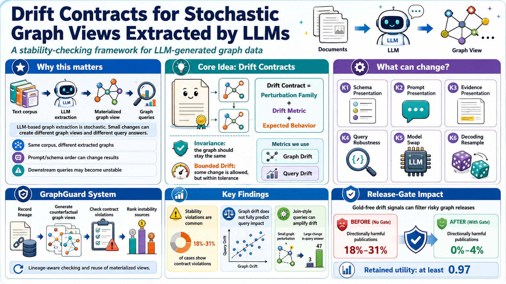
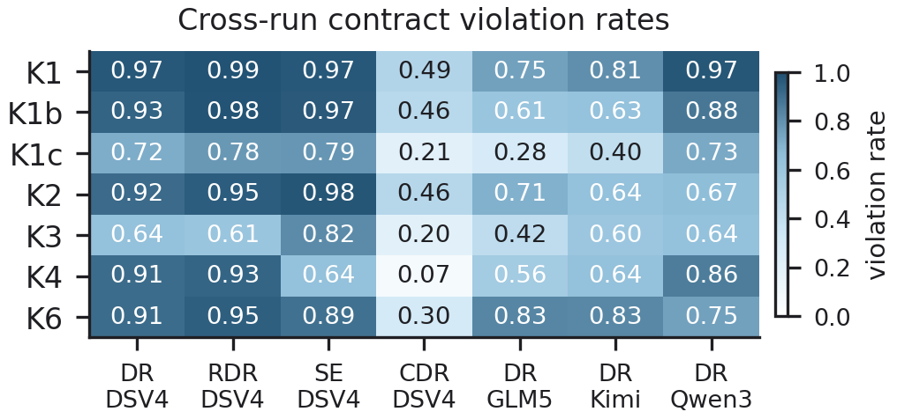
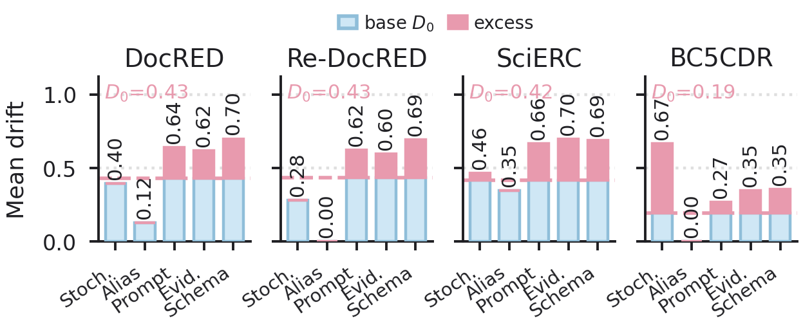
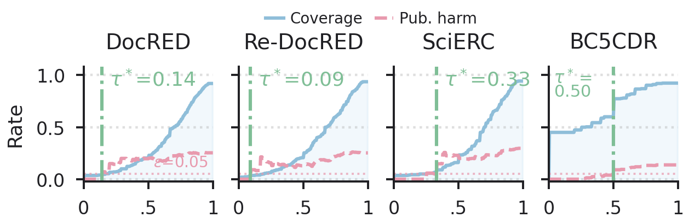
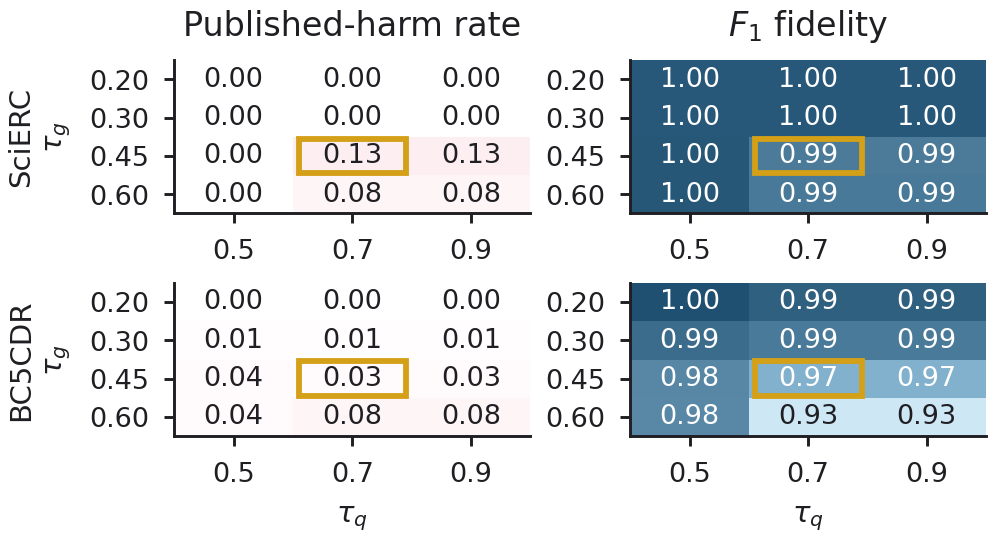
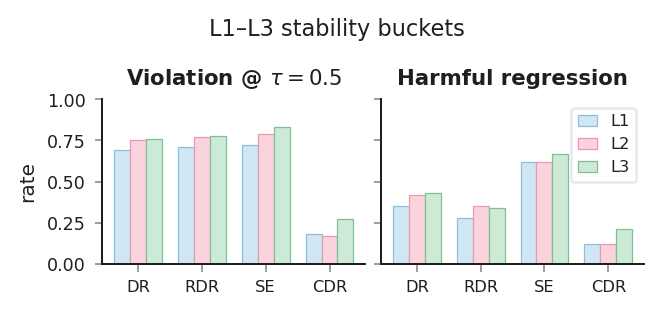
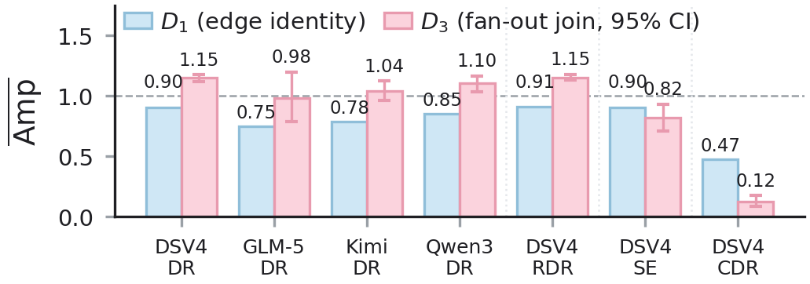
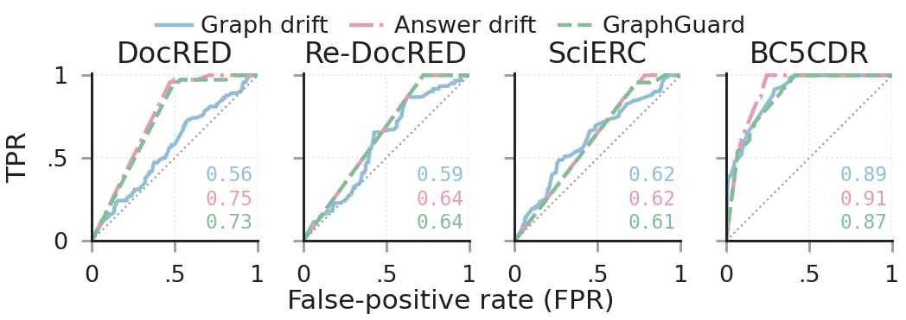
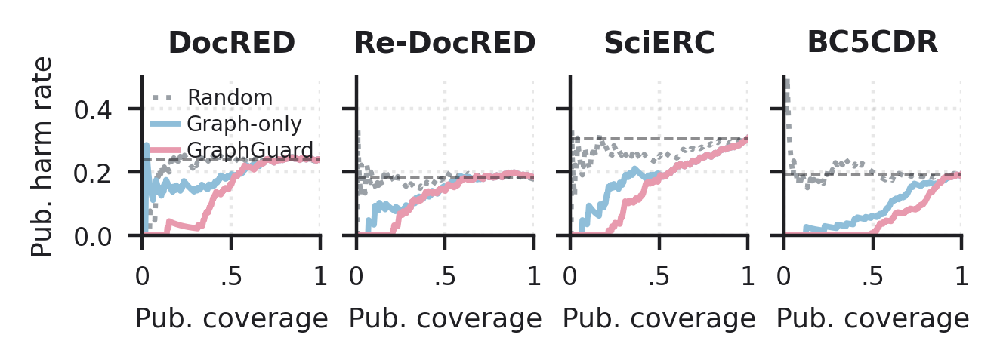
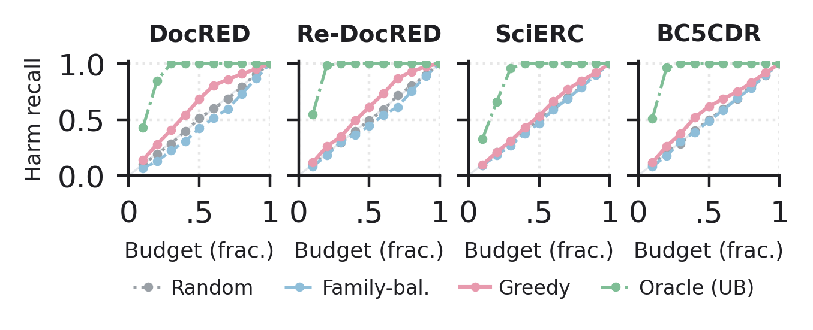

<div align="center">

# 🛡️ GraphGuard

### 🔬 Reliability Auditing for LLM-Extracted Graph Databases

#### 🧭 Treat the LLM-extracted graph as a materialized view — and audit it like one

**📜 Drift contracts · 🧩 Lineage-based counterfactuals · 🚦 Kuzu release gate**

📄 Paper: *Drift Contracts for Stochastic Graph Views Extracted by LLMs* \[Experiment, Analysis & Benchmark\]

[](https://www.python.org/)
[](https://kuzudb.com/)

</div>

**GraphGuard** is a reliability-auditing framework for graphs that LLMs extract from text and that downstream systems (Neo4j, LangChain `LLMGraphTransformer`, LlamaIndex property graphs, Microsoft GraphRAG, …) treat as persistent knowledge. Instead of asking *"is this extraction accurate?"*, GraphGuard asks *"does this graph behave like a stable materialized view when the corpus and intended schema do not change?"*. It encodes that question as a catalogue of declarative **drift contracts**, evaluates them with paired counterfactual extractions, and deploys the resulting drift signals as a **release gate** before ingestion into a graph database.

<div align="center">
  
  <br/>
  <sub><b>Project overview.</b> A base extraction materializes a graph view; controlled perturbations to schema, prompt, evidence, decoding, and model produce paired counterfactual views; drift contracts compare the two at the graph and at the query level; the same signals drive a release gate before Kuzu ingestion.</sub>
</div>

---

## 🧭 Why LLM-extracted graphs need view-level auditing

Real systems already treat LLM extractions as graphs that live downstream of the model: Neo4j's *LLM Knowledge Graph Builder* persists extracted entities and relations; LangChain's `LLMGraphTransformer` turns documents into graph documents; LlamaIndex builds property-graph indexes; Microsoft GraphRAG indexes entities, relationships, and claims. In all of these, the extracted graph is **stored, indexed, and queried** — it is a materialized graph view, not an intermediate model output.

That view turns out to be surprisingly unstable. With the document, schema, prompt template, evidence, and model held fixed, five controlled decoding samples (temperature 0.3; seeds 7, 13, 23, 37, and 53) have **mean edge overlap of only 0.57** on both DocRED and Re-DocRED. Schema reordering and prompt paraphrasing likewise flip downstream join-query answers. Conventional extraction metrics (accuracy, micro/macro F1) do not measure this paired-view stability because they score one materialization at a time.

GraphGuard fixes this with a contracts-first design: instability is reframed as **violations of declarative stability contracts over paired graph views**, and those violations become the unit of monitoring, calibration, and release-gate decisions.

---

## 🧪 Method

GraphGuard has three layers.

### 1. 📐 Stochastic graph views and drift contracts

Each extraction is modelled as a sample from a configuration-conditioned distribution $P(G \mid C, \theta)$ over graph views. A **drift contract** $\mathcal{K} = (\mathcal{F}, \mathcal{M}, \tau, \alpha, \kappa)$ specifies a perturbation family $\mathcal{F}$ (e.g. schema-presentation, prompt paraphrase, decoding resample), a metric $\mathcal{M}$ (edge Jaccard, type agreement, answer-set drift, …), a tolerance $\tau$, a population budget $\alpha$, and a class $\kappa\in\{\mathrm{I},\mathrm{B}\}$ for invariance or bounded drift. The default catalogue (paper Table 1):

| ID    | Operator expectation                                | Perturbation family / metric                          |
| ----- | --------------------------------------------------- | ----------------------------------------------------- |
| K1    | Schema names and order should not change the view   | `schema_rename`, `schema_reorder` (invariance)        |
| K1b   | Schema descriptions should not change the view      | `schema_desc` (invariance)                            |
| K1c   | Schema edits should have bounded graph drift        | `schema_coarse`, `schema_drop` (bounded drift)        |
| K2    | Prompt presentation should preserve the view        | `prompt_tone`, `persona`, `schema_first` (invariance) |
| K3    | Evidence order and aliases should preserve the view | `entity_alias`, `evidence_reorder` (invariance)       |
| K4    | Diagnostic fan-out-join drift should remain bounded | answer-set drift on canonical D3 (bounded, query-level) |
| K4b–d | Path / aggregation / RAG-retrieval drift bounded    | answer-set drift on Q5–Q7 (bounded, query-level)      |
| K5    | Model replacement should not cause large recall drift | `model_swap`, per-document \|Δrecall\| (bounded)    |
| K6    | Controlled decoding samples should produce a stable view | `decoding_resample` (invariance)                 |

### 2. 🧩 Lineage layer and paired counterfactuals

Every base and counterfactual extraction is recorded with a **configuration fingerprint** (model, schema, prompt, evidence presentation, retrieval policy, decoding parameters). A logical `paired_runs` view joins each base extraction with the matching counterfactual for the same document, so a single materialized endpoint can be reused across many contracts, metrics, and query templates. Relative to independently materializing both endpoints for every contract-pair evaluation, endpoint union achieves savings factors of **7.3×–8.1× for calls** and **7.3×–7.9× for token volume** across the four primary runs; counterfactual-only factors are **4.0×–4.5×** when base graphs already exist. The seven catalogue runs contain 33,043 extraction events (≈138 M tokens); the external-toolchain and Qwen-size experiments are reported separately.

### 3. 🚦 Materialization planning and release gate

A **budgeted scheduler** picks which counterfactual to materialize next given a token budget, using per-family harmful-regression rates estimated on a calibration split. The same drift signals — edge-set drift and answer-set drift through Cypher templates — are then deployed as a **gold-free release gate** before Kuzu ingestion: a graph is published only when both signals fall under their calibrated thresholds.

---

## 🔍 What the paper finds

### 🌀 Controlled decoding samples are unstable (K6)

With document, schema, prompt, evidence, and model fixed, we draw five controlled decoding samples per document (temperature 0.3; seeds 7, 13, 23, 37, and 53). On DocRED and Re-DocRED, **mean edge overlap is only 0.57**, and relation-type agreement is 0.79 and 0.78. Both disappearing-edge and new-edge rates are non-trivial. This establishes the non-zero stochastic baseline used by the remaining analyses; it is not evidence from literally identical decoding configurations.

### ⚠️ Most stability contracts fail under default tolerances

On the DocRED + DeepSeek-V4-Flash primary run, schema-presentation (K1, 0.97), schema-description (K1b, 0.93), prompt-presentation (K2, 0.92), diagnostic fan-out-join robustness (K4, 0.91), and decoding-resample (K6, 0.91) contracts all have **violation rates above 0.90**; the bounded schema-edit contract (K1c) violates at 0.72 and evidence-order/alias invariance (K3) at 0.64. Cross-model recall stability (K5) stays much lower (0.13); the registered artifacts use the identifier-first metric throughout.

<div align="center">
  
  <br/>
  <sub><b>Cross-run violations.</b> Darker cells = higher violation rates. The same qualitative pattern reappears across DocRED, Re-DocRED, SciERC, BC5CDR and four LLM extractors; BC5CDR drift is lower but still non-negligible.</sub>
</div>

### 🎯 Calibration and stability buckets

GraphGuard does **not** treat its default tolerances as universal constants. Three complementary checks confirm the diagnostics are robust:

<div align="center">
  
  <br/>
  <sub><b>Baseline-normalized drift.</b> Schema-presentation and evidence-order perturbations retain positive excess drift above the repeated-extraction baseline; pure entity-alias perturbations fall back to baseline after canonicalization.</sub>
</div>

<div align="center">
  
  <br/>
  <sub><b>SLA calibration.</b> Coverage and harmful-publication rate as the typed graph-drift threshold τ varies, with τ* = the largest τ satisfying a 5% harm-rate target. On the deterministic N=300 samples, graph-only coverage at that target spans 3–60%; at a 15% target it spans 8–92%, showing that usable thresholds are corpus-specific.</sub>
</div>

<div align="center">
  
  <br/>
  <sub><b>2D sensitivity.</b> The figure shows the two limiting profiles: SciERC sets the upper harm endpoint and BC5CDR the lower fidelity endpoint. The registered artifacts retain the complete four-corpus sweep. At τ<sub>g</sub>=0.45, τ<sub>q</sub>=0.70 (gold-bordered cell), four-corpus published harm is 0–13% and paired-view F1 fidelity is 0.97–1.00.</sub>
</div>

<div align="center">
  
  <br/>
  <sub><b>Stability buckets.</b> Instability already shows up under L1 (controlled decoding resampling + order-only changes): DocRED L1 answer-drift violation rate 0.69 and absolute query-divergence rate 0.35. Failures are not only artifacts of presentation or schema-definition rewrites.</sub>
</div>

### 📏 Controlled intensity separates perturbation fields

On 100 registered documents per corpus, nested token attenuation gives a reproducible four-level intensity scale. Unlike semantic rewriting, it provides ordered, nested interventions on a common measurable scale while identifiers, order, entities, and the output scaffold stay fixed. On complete four-level panels, evidence-text attenuation increases graph drift by **0.042–0.055 per additional 0.10 of actual masking**, with every 95% interval above zero. Schema-description effects are reliable only on Re-DocRED and SciERC, while prompt-instruction slopes show no consistent effect. Natural paraphrases remain a separate presentation family for realistic wording changes because surface distance does not provide the same ordered semantic or task dose.

### 🔌 Instability transfers to external extraction components

The same five perturbation axes were run through LangChain's `LLMGraphTransformer` and Neo4j GraphRAG's `LLMEntityRelationExtractor`. Mean graph drift is **0.59–0.65** for LangChain and **0.43–0.62** for Neo4j GraphRAG. We then materialized all 1,189 successful endpoints in Kuzu 0.11.3 and executed the shared Q1–Q4 catalogue: all **22,848 answer sets** match the deterministic executor, and query-contract violation rates remain **0.68–0.76** and **0.53–0.73**, respectively.

### 🔁 Queries can amplify or absorb graph drift

Graph-level drift does not translate uniformly into query-answer drift. In the canonical graph-wide diagnostic workload, DocRED **fan-out-join amplification D3 reaches 1.15 (95% document-cluster bootstrap CI [1.12, 1.17])**, while other diagnostics absorb part of the edge drift; edge-identity diagnostic D1 reproduces the typed edge set and serves as the no-amplification reference. On the sparser SciERC and BC5CDR schemas, D3 amplification falls to 0.82 and 0.12 because paired fan-out answers are often empty on both sides. D1–D5 are distinct from the gold-instantiated deployment Q1–Q4 used in RQ8–RQ10.

<div align="center">
  
  <br/>
  <sub><b>Diagnostic query amplification.</b> Edge identity (D1) and fan-out join (D3) across the paper runs; the dashed line marks Amp=1, while D1 is the empirical no-amplification reference (ε-damping places it below 1). D3 is above 1 on the primary DocRED, Re-DocRED, and Qwen3-32B runs, and near 1 on Kimi-K2 and GLM-5.</sub>
</div>

### 🌐 Joint-context extraction exhibits cross-document query drift

The BC5CDR stress test jointly extracts 100 prediction-independent, document-disjoint pairs with oracle MeSH linking and source-document provenance. Active-query drift is **0.187** under document-order changes and **0.150** under alternate-seed resampling. Their paired difference is 0.038 (95% CI [−0.023, 0.101]), so both comparisons show workload-visible instability without isolating additional drift specifically from order. All **1,000 Kuzu answer sets** match the deterministic executor; document-local identifiers produce no cross-document answers.

### 🎯 Drift signals track query divergence and directional regressions

On 4,000 gold-annotated paired comparisons with a non-empty gold-derived query workload, **43.6%** have a mean absolute per-query F1 change above 0.05. Graph drift has moderate correlations with absolute answer-side error: ρ(Drift, |ΔR|) = 0.219 and ρ(Drift, |ΔP|) = 0.135 (p < 10⁻³). K1 violations show a sharper contrast: violating pairs have mean |ΔR| = 0.070 and |ΔP| = 0.117, vs. 0.031 and 0.032 for satisfied pairs. For this mean-change target, mean answer-set drift has AUROC **0.90–0.99**, compared with **0.61–0.91** for graph drift. At strictly identical review budgets, it improves detection F1 in **14 of 16** corpus–budget comparisons and ties in two; the local/multi-hop split improves in **28 of 32** comparisons and ties in four. In the separate directional-regression evaluation, which retains maximum answer drift as an any-query sensitivity signal, AUROC is **0.58–0.89 for graph drift and 0.62–0.91 for answer-set drift**.

<div align="center">
  
  <br/>
  <sub><b>Threshold-free harmful-regression detection.</b> Answer-set drift is the stronger predictor on three of the four corpora (SciERC is effectively tied). The fixed OR gate is an operating policy, not a learned ranker, so its ROC need not dominate either input.</sub>
</div>

### 🚦 Kuzu release gate reduces harmful publications with gold-free signals

Deployed as a release gate before Kuzu ingestion, GraphGuard uses decision-time gold-free signals (typed-edge drift and Cypher answer-set drift) to publish or block each counterfactual graph. In this benchmark, gold relations deterministically instantiate the fixed query workload and gold answers define offline labels; once that workload is fixed, the gate decision only compares paired graph and answer sets. On the offline harm label (counterfactual mean per-query F1 drops by > 0.05), **20–30% of evaluated pairs are true regressions**; at the fixed operating point (τ<sub>g</sub>=0.45, τ<sub>q</sub>=0.70), the gate cuts published harm to **0–13% at paired-view F1 fidelity 0.97–1.00**, compared with 4–23% for graph-only gating and 18–30% for an exactly block-rate-matched random gate. Here F1 fidelity is `1 - mean(abs(F1_base - F1_cf))`, not absolute task utility. Under a strict 50/50 document-level split, the same fixed operating point gives held-out harm of **0–8%** at F1 fidelity ≥0.96, versus 21–29% for publish-all. Thresholds re-selected on the calibration half miss the 5% target on held-out BC5CDR (11%), exposing finite-sample calibration uncertainty (`reports/cross_run/gate_split.json`).

<div align="center">
  
  <br/>
  <sub><b>Kuzu gate risk–coverage.</b> Decision-time signals are gold-free; gold labels are used only for offline harm annotation.</sub>
</div>

<div align="center">
  
  <br/>
  <sub><b>Materialization planner.</b> Harm recall on the held-out deployment split vs. fraction of the full endpoint-union budget: the family-prior greedy planner reaches 39–52% at a 40% budget, with corpus- and budget-dependent advantages over the alternatives.</sub>
</div>

---

## 📒 Audited results ledger

The ledger below maps the paper's headline claims to their authoritative machine-readable artifacts. It was re-audited on 2026-08-19. Paths abbreviated as `RC` refer to `reports/cross_run/`; `RR` refers to `reports/runs/<run>/`. The complete ledger can be checked automatically with `python scripts/verify_paper_results.py`.

<details>
<summary><strong>Expand the claim-to-artifact ledger</strong></summary>

### §5.1 Stochastic baseline (RQ1)

| Claim | Value | Source |
| ----- | ----- | ------ |
| Controlled decoding-sample mean edge overlap, DocRED / Re-DocRED | 0.57 / 0.57 (raw view; temperature 0.3; seeds 7/13/23/37/53) | `RC/reproducibility_manifest.json` (`raw_stability`) |
| Type agreement | 0.79 / 0.78 | same manifest |
| Disappearing / new-edge rate | 0.28–0.29 | same manifest |
| Type-flip rate | 0.13 | same manifest |
| Label-erased vs. full-triple gap in Table 5 | 0.13–0.15 on rerun and presentation families only; alias 0.02 and semantic 0.25 are excluded | `RC/family_decomp_*.json` |

### §5.2 Contract outcomes (Table 4)

K1, K1b, K1c, K2, K3, K4, and K6 come from `RR/docred__deepseek-v4-flash__300d/eval/contracts.json`; K5 comes from `RC/k5_cross_model.json`.

| Contract | n | Mean metric | Violation rate |
| -------- | -: | ----------: | -------------: |
| K1 schema-presentation | 676 | 0.66 | 0.97 |
| K1b schema-description | 337 | 0.64 | 0.93 |
| K1c schema-definition (bounded) | 676 | 0.64 | 0.72 |
| K2 prompt-presentation | 534 | 0.62 | 0.92 |
| K3 evidence/alias | 78 | 0.41 | 0.64 |
| K4 diagnostic fan-out-join robustness | 2,301 | 0.76 | 0.91 |
| K5 cross-model recall | 294 | 0.10 | 0.13 |
| K6 stochastic repeatability | 78 | 0.51 | 0.91 |

K5 pools three DeepSeek-vs.-{Kimi, Qwen3-32B, GLM-5} comparisons using the identifier-first recall metric. One model-pair verdict is satisfied and two are inconclusive; the pooled violation rate is 0.13, below $\alpha=0.20$. Figure 2 excludes K5 because it is a cross-model contract. Its K1, K1b, K1c, K2, K3, K4, and K6 values are read from `RC/cross_run_summary.json` and match Table 4 at the catalogue tolerances.

### §5.2 K5 model-size ladder

Sources: `RC/k5_model_size.json` and `RC/k5_model_size_expressible.json`.

| Claim | Value |
| ----- | ----- |
| Mean recall, Qwen3 8B → 14B → 32B; DeepSeek | 0.107 → 0.122 → 0.140; 0.206 |
| Within-family mean \|Δrecall\|; fraction above tolerance | 0.05–0.08; 5–9% |
| Cross-family fraction above tolerance | 0.12–0.14; one satisfied and two inconclusive |
| Expressible-relation recall, excluding `OTHER` | 0.134 → 0.148 → 0.174; 0.260 |
| Expressible within-family fraction above tolerance | ≤0.14; 8B-vs.-14B is borderline inconclusive |
| Cross-family expressible fraction | 0.20, at the contract boundary |
| Pairwise graph drift between size variants | 0.75–0.86 |

### §5.3 Why BC5CDR has lower drift

Sources: `RC/family_decomp_cdr__deepseek-v4-flash__300d.json` and the contract reports.

| Mechanism | Value |
| --------- | ----- |
| Type agreement under binary CID + `OTHER` schema | 0.96–0.98; DocRED presentation edits have 24–27% mean relation-set disagreement |
| MeSH identifiers absorb alias changes | Edge overlap 1.00, vs. 0.51–0.82 elsewhere |
| Edges per document; rerun overlap | 2.5–3.2 vs. 7.4–10.7; 0.83 vs. 0.46–0.49 |
| Controlled evidence attenuation | At 75% masked evidence tokens, mean drift is 0.50 vs. a 0.13 same-input alternate-seed reference |

### §5.4 Calibration checks

| Figure | Claim | Source |
| ------ | ----- | ------ |
| Fig. 3, noise floor | D0 is 0.43 DocRED, 0.43 Re-DocRED, 0.42 SciERC, and 0.19 BC5CDR | `RC/reproducibility_manifest.json` (`raw_stability`), derived from lineage stability reports and read by `noise_floor_from_cache` |
| Fig. 4, SLA calibration | At $\epsilon=0.05$, graph-only coverage is 0.03–0.60; at $\epsilon=0.15$, it is 0.08–0.92 | `compute_calibration` on deterministic N=300 pairs |
| Fig. 5, 2D sensitivity | At (0.45, 0.70), four-corpus harm is 0–0.13 and F1 fidelity is 0.97–1.00; the figure shows the two limiting profiles | Registered Kuzu cohort artifacts indexed by `RC/deployment_evidence.json` |
| Fig. 6, DocRED L1 | Answer-drift violation is 0.69; absolute query-divergence rate is 0.35 | `RC/strict_vs_soft_*.json` |

### §5.5 Perturbation magnitude (RQ5, Fig. 7)

Source: `RC/magnitude_*.json`. The controlled run attempted 100 registered
documents per corpus. Five base calls failed; among endpoints with a valid
base, 22 parse failures and one API failure left 4,717 valid magnitude pairs
across the twelve family-by-level cells.

| Claim | Value |
| ----- | ----- |
| Same-input alternate-seed mean drift, DocRED / Re-DocRED / SciERC / BC5CDR | 0.460 / 0.492 / 0.472 / 0.127 |
| Evidence-text high-minus-low drift | +0.278 / +0.282 / +0.352 / +0.374; every 95% CI is above zero |
| Schema-description high-minus-low drift | +0.012 / +0.111 / +0.077 / +0.046; reliable only on Re-DocRED and SciERC |
| Prompt-instruction high-minus-low drift | +0.028 / +0.015 / +0.017 / +0.005; every 95% CI includes zero |
| Evidence slope per +0.10 actual masking | +0.0420 / +0.0433 / +0.0553 / +0.0555; every 95% CI is above zero |
| Schema slope per +0.10 actual masking | +0.0029 / +0.0169 / +0.0130 / +0.0064; reliable only on Re-DocRED and SciERC |
| Prompt slope per +0.10 actual masking | +0.0048 / +0.0001 / +0.0019 / -0.0004; every 95% CI includes zero |

### §5.6 External toolchains (RQ6, Table 6)

Sources: `RC/langchain_toolchain.json` and `RC/neo4j_toolchain.json`.
Each toolchain attempted the same 100 DocRED documents under a shared base and
five perturbations (600 document-condition endpoints); every axis has 99 valid
pairs.

| Axis | LangChain drift / violation | Neo4j GraphRAG drift / violation |
| ---- | ---------------------------: | --------------------------------: |
| Schema reorder | 0.62 / 0.98 | 0.60 / 0.94 |
| Schema rename | 0.65 / 1.00 | 0.62 / 0.94 |
| Prompt paraphrase | 0.59 / 0.92 | 0.53 / 0.87 |
| Evidence reorder | 0.63 / 0.93 | 0.62 / 0.90 |
| Decoding resample | 0.59 / 0.95 | 0.43 / 0.79 |

The shared, output-independent Q1–Q4 catalogue is also executed in actual
Kuzu 0.11.3 after exact benchmark-name/declared-alias mapping. Across the five
axes, mean per-pair maximum answer drift / query-contract violation is
0.63–0.71 / 0.68–0.76 for LangChain and 0.49–0.68 / 0.53–0.73 for Neo4j
GraphRAG. Both-empty answers are retained as zero drift. All 22,848 Kuzu
answer sets exactly match the deterministic executor.

The Neo4j run records JSON-object mode with
`extra_body.enable_thinking=false`; the historical LangChain checkpoint does
not record an equivalent thinking-control setting.

### §6.1 Cross-document workload (Table 7)

Sources: `RC/cross_document_cdr_cohort.json`,
`RC/cross_document_cdr_cache.jsonl`, its `.manifest.json` and `.audit.json`,
and `RC/cross_document_cdr.json`.

| Claim | Value |
| ----- | ----- |
| Registered enriched cohort | 100 prediction-independent, document-disjoint packets; 200 documents; oracle MeSH linking |
| Endpoint history | 302 recorded attempts; 300 final successful endpoints; two retry keys |
| Provenance-graph drift, order / seed | 0.320 [0.276, 0.365] / 0.280 [0.236, 0.323] |
| Active-query drift, order / seed | 0.187 [0.124, 0.255] / 0.150 [0.094, 0.211] |
| Paired active-query order-minus-seed difference | 0.038; 95% CI [−0.023, 0.101] |
| Kuzu parity and document-local negative | 1,000 answer sets, 0 mismatches; 0 cross-document answers with local identifiers |

The fanout and shared-tail queries require relation witnesses from different
source documents. This experiment evaluates provenance-constrained querying
within the benchmark's MeSH namespace; it does not test open-domain entity
linking, coreference, or relations supported only by combined cross-document
evidence.

### §6.1 Query amplification (RQ7, Figs. 8 and 9a)

Sources: `RC/diagnostic_*.json` and its compact `RC/amp_ci.json` summary for canonical graph-wide diagnostics D1–D5, plus `RC/extqueries_*.json` for Q5–Q7.

| Claim | Value | Scope |
| ----- | ----- | ----- |
| DocRED fan-out join Amp(D3) | 1.15, document-cluster CI [1.12, 1.17] | All 6,419 authoritative pairs from 299 documents |
| Edge-identity Amp(D1) | 0.901 DocRED, 0.910 Re-DocRED, 0.898 SciERC, 0.471 BC5CDR; ratio of means is 1.000 for all | D1 answer-set drift equals graph drift by construction; it is the empirical no-amplification reference |
| Cross-domain fan-out join Amp(D3) | 0.82 SciERC; 0.12 BC5CDR | Empty-vs.-empty answers are common |
| Q6 aggregation / Q7 RAG / Q5 path | 0.22–0.57 / 0.48–0.92 / 1.00–1.01 on the DocRED family | Q5 is conditioned on a base 2–3-hop path: 2,431 of 6,419 pairs |
| K4b/c/d presentation-class violation | 82% / 55% / 88% | Registered query-level contracts |
| BC5CDR shortest-path amplification | 1.27 | Conditioned on path existence |

### §6.2 Drift and accuracy (RQ8, Fig. 10)

Sources: `RC/drift_accuracy_docred__deepseek-v4-flash__300d.json` and the registered pair records indexed by `RC/deployment_evidence.json`.

| Claim | Value | Scope |
| ----- | ----- | ----- |
| Absolute query-divergence population / base rate | 4,000 / 43.6% | Mean absolute per-query F1 change >0.05; not directional |
| $\rho(\mathrm{Drift},\lvert\Delta R\rvert)$; $\rho(\mathrm{Drift},\lvert\Delta P\rvert)$ | 0.219; 0.135, both p<10⁻³ | |
| K1 violated vs. satisfied mean $\lvert\Delta R\rvert/\lvert\Delta P\rvert$ | 0.070/0.117 vs. 0.031/0.032 | 656 vs. 20 pairs |
| Directional-regression AUROC, graph vs. answer-set | 0.58–0.89 vs. 0.62–0.91 | |
| Directional-regression AUPRC, graph vs. answer-set | 0.32–0.70 vs. 0.67–0.73 | Trapezoidal PR integration |
| SciERC AUROC | Graph 0.627; answer 0.623; gate 0.643 | Effectively tied; answer-set leads on the other three corpora |

### §6.2–6.3 Query-aware vs. graph-only detection (Fig. 9b, RQ9)

Sources: `RC/graph_vs_query_*.json` and `RC/regimes_*.json`.

The evaluation target is mean absolute per-query gold-F1 change above 0.05. The target-aligned query score is mean answer-set Jaccard drift over the same registered query instances; maximum answer drift is also emitted as an any-query sensitivity score. Gold defines the offline target, while both scores use paired predictions only.

| Corpus | Graph AUROC | Query-mean AUROC | Query-max AUROC |
| ------ | ----------: | ---------------: | --------------: |
| DocRED | 0.611 | 0.956 | 0.843 |
| Re-DocRED | 0.624 | 0.946 | 0.715 |
| SciERC | 0.735 | 0.896 | 0.780 |
| BC5CDR | 0.913 | 0.990 | 0.984 |

Query-mean minus graph-only F1 at strictly identical review counts:

| Corpus | 30% | 50% | 70% | 90% |
| ------ | --: | --: | --: | --: |
| DocRED | +0.342 | +0.329 | +0.160 | +0.028 |
| Re-DocRED | +0.283 | +0.295 | +0.156 | +0.029 |
| SciERC | +0.050 | +0.079 | +0.090 | +0.030 |
| BC5CDR | +0.193 | +0.012 | 0.000 | 0.000 |

The query-mean score improves 14 of 16 corpus–budget cells and ties in two. The local and multi-hop analyses use the same four exact budgets and improve 28 of 32 cells, with four ties; at 30%, multi-hop gains are +0.068, +0.197, +0.106, and +0.164 for DocRED, Re-DocRED, SciERC, and BC5CDR. Ties at the review boundary are resolved by SHA-256 of the pair ID without using target labels.

### §6.4 Kuzu release gate (RQ10, Figs. 11 and 12)

Sources: the registered Kuzu cohort artifacts indexed by `RC/deployment_evidence.json` for full data and `RC/gate_split.json` for held-out results.

| Setting | Harm | F1 fidelity | Recall |
| ------- | ---- | ----------- | ------ |
| Publish-all, full data | 20–30% | — | — |
| GraphGuard at (0.45, 0.70), full data | 0–13% | 0.97–1.00 | 0.90–1.00 |
| GraphGuard at (0.45, 0.70), held out with frozen thresholds | 0–8% (DocRED 8.0%, Re-DocRED 0%, SciERC 0%, BC5CDR 5.3%) | ≥0.96, minimum 0.963 | 0.85–1.00 |
| GraphGuard held out, thresholds re-selected on calibration split | 0–11% | 0.93–1.00 | 0.61–1.00 |
| Publish-all, held out | 21–29% | — | — |
| Graph-only, full data | 4–23% | — | — |
| Exactly block-rate-matched random, seed 0 | 18–30% | — | — |
| Budget planner harm recall at 40% / 60% budget | 39–52% / 58–78% | — | — |

The matched-random row and `RC/tab_e2ekuzu.tex` are both derived from the registered Kuzu pair records; the budget row comes from `RC/budget_planner.json`.

### Known limitations of the reported results

- The full-data operating point was selected on the same 300-pair samples; the frozen 50/50 document split is the stricter estimate.
- Re-selecting thresholds on the calibration half misses the 5% target on held-out BC5CDR (11%), so the paper does not present threshold re-selection as an improvement.
- Diagnostic D1 drift equals graph drift by definition because it returns the complete typed edge set; it is a reference, not an independent stability signal.
- The pooled K5 Table 4 violation rate of 0.13 masks two inconclusive model-pair comparisons; the manuscript therefore reports that model-pair verdicts are mixed.

</details>

---

## ⚙️ Reproducing the paper

The repository ships machine-readable result artifacts under `reports/runs/` and `reports/cross_run/`. The paper's headline numbers and generated figures can be checked or rebuilt without raw corpora, lineage databases, or LLM calls. The private manuscript's hand-authored declarative tables and source-backed numerical tables have a separate final-mile checker.

Run all commands below from the repository root.

### Authoritative result-to-script map

`DB` below means the named local SQLite file
`data/processed/runs/<run>/<run>.db`; never use an unqualified `run.db`.
`RC` means `reports/cross_run/`, and `RR` means
`reports/runs/<run>/`.

| Result family | Sole producer / rebuild command | Direct authoritative input | Paper-facing output |
| ------------- | ------------------------------- | -------------------------- | ------------------- |
| Run lineage and RQ1 baseline | `run_paper_experiment.py`; `run_e0_stability.py`; `build_reproducibility_manifest.py` | raw corpus + API → seven named DBs | `RC/reproducibility_manifest.json` |
| Exact document samples | `export_sampled_document_ids.py` | seven named DBs + configured split/limit | `RC/sampled_document_ids.json`, Table 2 |
| K1–K4/K6 contracts and cross-run replication | `run_contracts.py`; `aggregate_cross_run.py` | named DBs → `RR/*/eval/contracts.json` | `RC/cross_run_summary.json`, Fig. 2, Table 4 |
| K5 cross-model and size ladder | `run_k5_cross_model.py`; `run_model_size_k5.py`; `run_model_size_k5_expressible.py` | primary, GLM/Kimi/Qwen-32B, and Qwen-8B/14B DBs | `RC/k5_cross_model.json`, `RC/k5_model_size*.json`, Table 4 and size sensitivity |
| Per-family decomposition | `run_family_decomposition.py` | four primary DBs | `RC/family_decomp_*.json`, Table 5 and response table |
| Stability buckets | `run_stability_bucket_analysis.py` | four primary DBs | `RC/strict_vs_soft_*.json`, Fig. 6 |
| Perturbation magnitude | `run_magnitude_analysis.py --run-controlled` | four primary DBs + prompt/schema configs + API; `--analyze-only` reads the raw checkpoint and `--fig-only` reads cached JSON | `RC/magnitude_*.json`, Fig. 7 |
| Diagnostic D1–D5 amplification | `run_diagnostic_queries.py --overwrite`; `compute_amp_ci.py` | seven named DBs | `RC/diagnostic_*.json`, `RC/amp_ci.json`, Fig. 8 |
| Extended Q5–Q7 | `run_extended_queries.py` | seven named DBs | `RC/extqueries_*.json`, Fig. 9a |
| BC5CDR cross-document stress test | `run_cross_document_experiment.py`; `package_cross_document_checkpoint.py` | registered BC5CDR source + CDR DB; API only for extraction | `RC/cross_document_cdr_cohort.json`, public cache/manifest/audit, `RC/cross_document_cdr.json`, Sec. 6.1 |
| Deployment Q1–Q4 evidence | `run_deployment_queries.py` → `validate_deployment_kuzu_parity.py` → `run_deployment_downstream.py` → `build_deployment_cohorts.py` → `run_deployment_kuzu_cohort.py` → `package_deployment_evidence.py` | four primary DBs; fixed label-blind cohort anchors | 17 hash-indexed artifacts in `RC/deployment_evidence.json` |
| RQ8 drift/accuracy | `run_drift_accuracy_analysis.py` | registered downstream artifact + primary DocRED DB for K1 | `RC/drift_accuracy_*.json`, Fig. 10 statistics |
| RQ9 query-aware contracts | `run_graph_vs_query_ablation.py --run <run>`; `run_regime_analysis.py` | registered downstream artifacts | `RC/graph_vs_query_*.json`, `RC/regimes_*.json`, Fig. 9b |
| RQ10 gate and held-out split | `make_kuzu_gate_artifacts.py`; `make_gate_figure.py`; `run_gate_split_analysis.py` | registered Kuzu cohort artifacts | `RC/tab_e2ekuzu.tex`, `RC/gate_split.json`, Figs. 11–12 |
| RQ10 budget planner | `run_budget_planner.py` | registered Kuzu cohort artifacts | `RC/budget_planner.json`, Fig. 12 |
| Endpoint reuse | `run_endpoint_reuse_analysis.py` | four primary DBs + contract reports | `RC/endpoint_reuse.json` |
| External toolchains and Kuzu Q1–Q4 | `run_langchain_toolchain.py`; `run_additional_toolchains.py --toolchain neo4j`; `run_external_toolchain_queries.py --workers 4` | primary DocRED DB; `RC/{langchain,neo4j}_toolchain_cache.jsonl` + hash-bound checkpoint metadata | `RC/{langchain,neo4j}_toolchain.json`; `RC/external_toolchain_q1q4_kuzu.json`; Table 6 and response table |
| Final figures and tables | figure producers listed in step 3; `sync_paper_figures.py`; `verify_manuscript_artifacts.py` | authoritative JSON above | 13 active figures and seven active `main.tex` tables |

All 13 active manuscript figures are PDF inputs. The 12 data figures are
exported as vector PDFs with matching PNG previews for this README;
`fig_contract_overview.pdf` is an author-created mixed vector/raster PDF. The three
declarative tables (contracts, runs, and queries) are checked against the
registries/configuration, while the four numerical tables and their
response-letter counterparts are checked directly against JSON values.

Each result family has one canonical artifact. The RQ8–RQ10 chain
is indexed by `deployment_evidence.json`; deterministic cohort anchors are
reconstructed from the four lineage databases and checked against fixed
run-ID digests in `build_deployment_cohorts.py`. Only the canonical result
families listed above are retained.

There are four reproducibility levels:

| Level | What it verifies or rebuilds | Raw corpora | Lineage DBs | API |
| ----- | ---------------------------- | :---------: | :---------: | :-: |
| Cached-artifact check | Headline claims, generated figures, and gate artifacts | No | No | No |
| Pair-level re-analysis | Stability, drift/accuracy, family, external-toolchain Kuzu queries, extended-query, regime, and K5 JSON | No | Yes | No |
| Cross-document maintainer replay | Joint two-document BC5CDR outputs, historical per-document baseline, and Kuzu query parity | Yes | Yes | No calls; registered provider fingerprint required |
| End-to-end re-extraction | Extraction events and every downstream artifact | Yes | Rebuilt | Yes |

End-to-end extraction is not bitwise deterministic because the hosted model provider can remain nondeterministic even with `temperature=0` and a fixed seed. Cached-artifact and lineage re-analysis are the appropriate checks for the submitted numbers.
The shipped magnitude JSON supports API-free verification and figure rebuilding.
Re-running its controlled extraction requires the API because the 27 MB raw
response checkpoint is intentionally kept under ignored `data/processed/`.
The public cross-document cache retains the normalized MeSH/provenance edges,
endpoint fingerprints, token counts, and retry history but removes provider
response text. The cached verifier needs neither the corpus nor an API call;
full packet-level reconstruction also reads the registered BC5CDR source and
CDR lineage DB to rebuild the cohort and historical per-document baseline. The
historical runner also checks the registered model and endpoint fingerprints
from the original environment, although analysis makes no API request.
The private, ignored checkpoint is
`data/processed/cross_document/cross_document_cdr.jsonl`, with its manifest at
the same path plus `.manifest.json`. The public replay package is
`reports/cross_run/cross_document_cdr_cache.jsonl`, accompanied by
`.manifest.json` and `.audit.json`; the registered cohort and summary are the
two JSON files named in the ledger above.

### Resource envelope

No local GPU is required: all LLM extraction calls use a hosted
OpenAI-compatible API, and the remaining stages are CPU-only. The measurements
below were taken on Linux with Python 3.10, a 16-thread Intel i7-12700KF, and
20 GiB RAM. They are planning estimates rather than performance claims.

| Level | Network / credentials | Local storage | Observed wall time | Peak RAM |
| ----- | --------------------- | ------------: | -----------------: | -------: |
| Cached result verification | package installation only | 92 MiB `reports/` | about 20 s | about 1.1 GiB |
| Test suite (186 tests) | package installation only | repository checkout | about 25 s | about 1.2 GiB |
| External-toolchain Kuzu Q1–Q4 replay | no network; primary DocRED DB required | DB + two published checkpoints | about 2 min with four workers | about 1 GiB |
| Cross-document maintainer replay | no network; BC5CDR source, CDR DB, and registered provider fingerprint required | DB + about 1.5 MiB public artifacts | about 30 s | under 1 GiB |
| Cross-document joint extraction | Model Studio key | DB + about 1 MiB private checkpoint | about 25.5 min for 300 registered endpoints | under 1 GiB |
| Cached analyses and all generated figures | package installation only | repository checkout | about 30 s | under 2 GiB |
| Seven-run lineage verification | no API; local DBs required | about 728 MiB for the seven lineage DBs | about 25 s | about 1.1 GiB |
| End-to-end catalogue extraction | dataset downloads + Model Studio key | at least 1 GiB plus caches | provider/rate-limit dependent | under 4 GiB locally |

The seven catalogue runs contain 137,646,379 recorded input-plus-output tokens;
the external-toolchain and Qwen-size experiments are separate. API wall time and monetary
cost are not fixed because provider throughput and prices can change. Reviewers
who do not have matching provider access should use the cached-artifact path;
it covers every paper-facing headline number. Lineage-level reconstruction
requires the per-run SQLite databases, which are rebuilt by the end-to-end
commands but are not committed to Git.

### 0. ✅ Verify the reported results

```bash
# Works from the canonical reports alone.
python scripts/verify_paper_results.py

# Additionally recount the seven tabulated runs from local lineage SQLite DBs.
python scripts/verify_paper_results.py --lineage

# If the private, git-ignored manuscript is present, also check every active
# figure copy and every source-backed table in main.tex and response.tex.
python scripts/verify_manuscript_artifacts.py

# Rebuild endpoint-union call/token savings from the four primary lineage DBs.
python scripts/run_endpoint_reuse_analysis.py
```

The first command validates the authoritative JSON artifacts, including the 17-entry RQ8–RQ10 evidence package and the public cross-document cache. It checks the exact sampled-document lists, raw repeated-extraction baseline, run totals, contract table, endpoint-union savings, query analyses, cross-document retry history and packet summaries, directional-regression metrics, release gate, and budget planner. `reports/cross_run/deployment_evidence.json` records the size, SHA-256, schema version, source run, and cross-artifact provenance of every registered deployment artifact; large logical JSON files use one deterministic gzip transport. With `--lineage`, the verifier also checks the samples against the seven run databases, recomputes endpoint-union savings on the four primary runs, and recounts 33,043 events (28,482 primary + 4,561 cross-model) and 137,646,379 tokens directly from SQLite.

### 1. 🛠️ Install

For the locked evaluation environment, install
[`uv`](https://docs.astral.sh/uv/) and use the committed `uv.lock`:

```bash
uv sync --locked --extra dev
source .venv/bin/activate

# Software checks
pytest -q

# Only needed for the LangChain toolchain experiment in step 7:
uv sync --locked --extra dev --extra toolchain

# Only needed for end-to-end re-extraction:
cp .env.example .env
# Set OPENAI_BASE_URL, OPENAI_API_KEY, OPENAI_MODEL in .env
```

The root lock targets Python 3.10 and covers GraphGuard and the LangChain
toolchain extra. The Neo4j extraction used a separate environment: cached
analysis and Kuzu replay need no Neo4j installation, while full API
re-extraction uses the recorded direct dependency pins in step 7. Those pins
do not constitute a full transitive lock for the external Neo4j environment.
A conventional editable install remains available for development
(`python -m pip install -e '.[dev]'`), but only the `uv --locked` path
recreates the evaluated GraphGuard dependency resolution. The paper used
Alibaba Cloud Model Studio's OpenAI-compatible API; endpoint and key regions
must match. Hosted model aliases can change after the reported runs, so new
API extractions are behavioral replications rather than bitwise
reconstructions.

### 2. 📦 Dataset setup

Raw corpora are **not** shipped with the repo (they have separate licences); you only need them if you plan to re-run the extraction pipeline. Cached-result verification and figure/table regeneration use only `reports/`.

If you do want to re-extract, place each corpus under `data/raw/` exactly as below — every adapter under `graphguard/data/` and every config in `configs/*.yaml` expects this layout.

```text
data/raw/
├── docred/                                        # auto-downloaded via 🤗 datasets ("docred")
│   └── (left empty — cached into data/cache/hf/ on first run)
├── redocred/                                      # Re-DocRED revised splits
│   ├── train_revised.json
│   └── dev_revised.json
├── scierc/processed_data/json/                    # SciERC official JSON release
│   ├── train.json
│   ├── dev.json
│   └── test.json
└── cdr/CDR_Data/CDR.Corpus.v010516/               # BioCreative V CDR corpus
    ├── CDR_TrainingSet.PubTator.txt
    ├── CDR_DevelopmentSet.PubTator.txt
    └── CDR_TestSet.PubTator.txt
```

Where to download each one:

| Corpus       | Source                                                                                          | Notes                                                                                                  |
| ------------ | ----------------------------------------------------------------------------------------------- | ------------------------------------------------------------------------------------------------------ |
| **DocRED**     | Hugging Face hub: [`docred`](https://huggingface.co/datasets/docred)                            | Fetched automatically by `graphguard/data/load_docred.py` on first call; cached under `data/cache/hf/`. |
| **Re-DocRED**  | GitHub: [`tonytan48/Re-DocRED`](https://github.com/tonytan48/Re-DocRED) → `data/`                | Copy `train_revised.json` and `dev_revised.json` into `data/raw/redocred/`.                            |
| **SciERC**     | AllenAI release: [`sciie.tar.gz`](http://nlp.cs.washington.edu/sciIE/data/sciie.tar.gz)         | Untar and keep the inner `processed_data/json/{train,dev,test}.json`.                                  |
| **BC5CDR**     | BioCreative V CDR: [BioC.zip](https://biocreative.bioinformatics.udel.edu/tasks/biocreative-v/track-3-cdr/) | Place the complete `CDR.Corpus.v010516/` release under `data/raw/cdr/CDR_Data/`; GraphGuard reads its three `*.PubTator.txt` files. |

Each dataset path is referenced exactly once, from its YAML in `configs/`:

| Config                  | `local_files` / `local_dir`                                       |
| ----------------------- | ----------------------------------------------------------------- |
| `configs/docred.yaml`   | none (Hugging Face `hf_name: docred`)                             |
| `configs/redocred.yaml` | `data/raw/redocred/{train,dev}_revised.json`                       |
| `configs/scierc.yaml`   | `data/raw/scierc/processed_data/json/{train,dev,test}.json`        |
| `configs/cdr.yaml`      | `data/raw/cdr/CDR_Data/CDR.Corpus.v010516/`                        |

You can sanity-check the layout with:

```bash
ls data/raw/redocred/{train,dev}_revised.json \
   data/raw/scierc/processed_data/json/{train,dev,test}.json \
   data/raw/cdr/CDR_Data/CDR.Corpus.v010516/CDR_{Training,Development,Test}Set.PubTator.txt \
  && echo "raw data layout OK"
```

After DocRED has been downloaded once and mirrored to
`data/cache/hf/datasets/thunlp__docred/validation.jsonl`, verify every paper
input against the exact files used for the reported runs:

```bash
sha256sum --check data/CHECKSUMS.sha256
```

The checksum file is the immutable input identity. It detects upstream dataset
changes without redistributing corpora whose licences are maintained by their
original publishers.

### 3. 🖼️ Regenerate the generated figures and tables (no API calls)

```bash
# Rebuild RQ9 summaries from the shipped, hash-checked evidence.
for run in \
  docred__deepseek-v4-flash__300d \
  redocred__deepseek-v4-flash__300d \
  scierc__deepseek-v4-flash__100d \
  cdr__deepseek-v4-flash__300d
do
  python scripts/run_graph_vs_query_ablation.py --run "$run"
done
python scripts/run_regime_analysis.py

# Rebuild RQ10 derived summaries.
python scripts/run_gate_split_analysis.py
python scripts/run_budget_planner.py

# Core figure set (cross-run violations, noise floor, calibration,
# 2-D sensitivity, strict-vs-soft, Amp(Q) consistency, AUROC)
python scripts/make_paper_figures.py            # writes vector PDFs + PNG previews

# Perturbation-magnitude figure (paper Fig. 7)
python scripts/run_magnitude_analysis.py --fig-only

# Extended-query + regime figure (paper Fig. 9)
python scripts/make_extqueries_figure.py

# Release-gate outcome bars (paper Fig. 11)
python scripts/make_gate_figure.py

# Risk-coverage figure (paper Fig. 12, top) + per-policy gate table
python scripts/make_kuzu_gate_artifacts.py

# Verify the regenerated summaries and figures.
python scripts/verify_paper_results.py
```

`make_paper_figures.py` accepts a target argument: `all` (default), `contracts` (cross-run violations / diagnostic amplification / strict-vs-soft) or `evaluation` (noise-floor / calibration / 2D-sensitivity / AUROC). All commands in this section consume the canonical artifacts under `reports/`; the noise-floor panel reads D0 from `reproducibility_manifest.json`, whose producer derives it from the four primary lineage DBs. No command in this section needs raw corpora, a lineage DB, or API access. Rebuilding the RQ8 K1 contrast with `scripts/run_drift_accuracy_analysis.py` additionally requires the local DocRED lineage DB; the shipped summary is still checked by `verify_paper_results.py` without that DB.

The public artifact intentionally excludes the private manuscript. Maintainers
who have `paper/` locally can perform the additional final-mile check:

```bash
python scripts/sync_paper_figures.py --write
python scripts/verify_manuscript_artifacts.py
```

The Kuzu-backed workload is pinned to `kuzu==0.11.3`, the version used for the reported gate experiment.

### 4. 🔁 Re-run an experiment end to end (needs API credentials)

End-to-end experiments are driven by `scripts/run_paper_experiment.py` using profiles from `configs/experiments/`. Each profile fixes the document count, counterfactual budget, oracle subset size, and stability-subset size. The driver runs the full pipeline:

```text
prepare → extract → interventions → oracle → main → e0 → contracts
```

The lineage database and repeated-extraction report land in
`data/processed/runs/<run>/`; the registered contract JSON and Markdown land
in `reports/runs/<run>/eval/`.

```bash
set -a && . ./.env && set +a   # so subprocesses inherit API credentials

# Four primary runs used in the paper
python scripts/run_paper_experiment.py \
  --config configs/experiments/docred_paper.yaml \
  --profile main300 \
  --run-name docred__deepseek-v4-flash__300d \
  --model deepseek-v4-flash \
  --workers 8

python scripts/run_paper_experiment.py \
  --config configs/experiments/redocred_paper.yaml \
  --profile main300 \
  --run-name redocred__deepseek-v4-flash__300d \
  --model deepseek-v4-flash \
  --workers 8

python scripts/run_paper_experiment.py \
  --config configs/experiments/scierc_paper.yaml \
  --profile main100 \
  --run-name scierc__deepseek-v4-flash__100d \
  --model deepseek-v4-flash \
  --workers 8

python scripts/run_paper_experiment.py \
  --config configs/experiments/cdr_paper.yaml \
  --profile main300 \
  --run-name cdr__deepseek-v4-flash__300d \
  --model deepseek-v4-flash \
  --workers 8
```

The four commands write lineage databases to `data/processed/runs/<run-name>/<run-name>.db` and reports to `reports/runs/<run-name>/`. Existing runs resume safely: use `--start-at <stage>` to resume from a particular stage, and already cached extraction events are skipped automatically. Do not use `--fresh` unless you intend to delete that run's local database and start it again.

### 5. 🧮 Refresh cross-run aggregations and amplification CIs

After any end-to-end re-run, rebuild the cross-run summaries that feed the paper figures:

```bash
python scripts/build_reproducibility_manifest.py
python scripts/run_diagnostic_queries.py --overwrite
python scripts/aggregate_cross_run.py   # writes reports/cross_run/cross_run_summary.json
python scripts/compute_amp_ci.py        # writes reports/cross_run/amp_ci.json
python scripts/make_paper_figures.py    # regenerate every figure that consumes them
```

### 5a. Rebuild or replay the RQ8–RQ10 deployment evidence

The submitted RQ8–RQ10 package is fail-closed: the registered cohort manifest
and each transport artifact are hash-bound in
`reports/cross_run/deployment_evidence.json`. With the four primary lineage
databases available, replay the registered Kuzu cohort without changing the
published package:

```bash
# Two registered pairs per corpus; writes only under /tmp.
python scripts/run_deployment_kuzu_cohort.py --mode smoke

# Complete N=300-per-corpus replay; also keep it separate from the package.
python scripts/run_deployment_kuzu_cohort.py \
  --mode complete \
  --out-dir /tmp/graphguard-kuzu-complete \
  --overwrite
```

For a new end-to-end extraction, rebuild the logical Q1–Q4 evidence and parity
records with the following exact sequence:

```bash
python scripts/run_deployment_queries.py --overwrite

runs=(
  docred__deepseek-v4-flash__300d
  redocred__deepseek-v4-flash__300d
  scierc__deepseek-v4-flash__100d
  cdr__deepseek-v4-flash__300d
)
for run in "${runs[@]}"; do
  python scripts/validate_deployment_kuzu_parity.py \
    --db "data/processed/runs/${run}/${run}.db" \
    --artifact "reports/cross_run/deployment_q1q4_${run}.json" \
    --out "reports/cross_run/deployment_q1q4_${run}__kuzu_parity.json" \
    --overwrite
done

python scripts/run_deployment_downstream.py --overwrite
python scripts/build_deployment_cohorts.py --overwrite
```

A newly built cohort is a candidate artifact, not the submitted cohort. The
complete Kuzu runner deliberately refuses to label it “official” until its
manifest hash is reviewed and registered in the implementation. Maintainers
then run `run_deployment_kuzu_cohort.py --mode complete`, followed by
`package_deployment_evidence.py`; external reviewers should replay the already
registered manifest as shown above.

### 6. 🔬 Cross-model checks on DocRED

```bash
set -a && . ./.env && set +a

# The paper uses the same first 100 DocRED validation documents for each model.
python scripts/run_paper_experiment.py \
  --config configs/experiments/docred_paper.yaml \
  --profile medium \
  --run-name docred__glm-5__100d \
  --model glm-5 \
  --workers 8

python scripts/run_paper_experiment.py \
  --config configs/experiments/docred_paper.yaml \
  --profile medium \
  --run-name docred__kimi-k2__100d \
  --model Moonshot-Kimi-K2-Instruct \
  --workers 8

python scripts/run_paper_experiment.py \
  --config configs/experiments/docred_paper.yaml \
  --profile medium \
  --run-name docred__qwen3-32b__100d \
  --model qwen3-32b \
  --workers 8

python scripts/run_k5_cross_model.py
python scripts/aggregate_cross_run.py
python scripts/compute_amp_ci.py
```

### 7. 🔁 Additional analyses

The cached outputs of every additional analysis ship under `reports/cross_run/`
and `reports/runs/<run>/` (magnitude, extended and cross-document queries,
regimes, per-family decomposition, external toolchains, K5 model-size ladder and its
expressible-schema sensitivity, gate calibration/deployment split, and the
drift/accuracy analysis). Use
`python scripts/verify_paper_results.py` to validate their paper-facing
numbers. Re-deriving most pair-level JSON needs the local per-run lineage
databases under `data/processed/runs/` (rebuilt by step 4); these SQLite files
are not committed.

With the four primary databases from step 4, the following analyses are
offline:

```bash
python scripts/run_family_decomposition.py      # Sec. 5.1: per-family decomposition
python scripts/run_regime_analysis.py           # Sec. 6.2: regime detection
python scripts/run_drift_accuracy_analysis.py   # Sec. 6.2: drift/accuracy statistics
python scripts/run_stability_bucket_analysis.py # Sec. 5.4: L1/L2/L3 buckets
```

The cross-document stress test uses 100 document-disjoint BC5CDR pairs selected
without model predictions. Each pair has a gold witness for either a fanout or
shared-tail query, so this is an enriched stress-test cohort rather than a
random corpus sample. The joint extractor receives both documents and an
oracle MeSH registry; every predicted relation retains its supporting source
document. It does not evaluate open-domain entity resolution, coreference, or
relations whose evidence exists only across documents.

```bash
# Verify the shipped cache and paper-facing summary; no corpus, DB, or API.
python scripts/verify_paper_results.py

# Maintainer replay of all 1,000 Kuzu answer sets. This makes no API call but
# requires the BC5CDR source, CDR DB, and original model/endpoint fingerprint.
python scripts/run_cross_document_experiment.py --analyze-only \
  --checkpoint reports/cross_run/cross_document_cdr_cache.jsonl \
  --output /tmp/cross_document_cdr_reanalysis.json

# Repeat the 300 registered joint endpoints, then package a public replay cache.
# Run --build-cohort first only when rebuilding the registered cohort.
python scripts/run_cross_document_experiment.py --build-cohort
python scripts/run_cross_document_experiment.py --extract
# If the first extraction leaves failed endpoints, repeat with --retry-failures.
python scripts/run_cross_document_experiment.py --extract --retry-failures
python scripts/run_cross_document_experiment.py --analyze-only
python scripts/package_cross_document_checkpoint.py
```

The final packaging step validates the private manifest hash, relocates only
its recorded path to the byte-identical public manifest, and writes the audit
last. A failed preflight therefore leaves the existing public package
unchanged; an interrupted multi-file update fails the verifier's hash chain.

The completed extraction has 300 successful registered endpoints. Its
append-only history contains 302 recorded endpoint attempts because two
length-truncated responses were retried, for 1,475,253 recorded tokens in
total. Provider-client transport retries, if any, are not logged as separate
attempts.

The published Sec. 5.5 figure is rebuilt offline from the cached reports:

```bash
python scripts/run_magnitude_analysis.py --fig-only
```

To repeat the controlled extraction itself, first validate the registered
400-document condition grid, then run the API-backed experiment. The raw
checkpoint is resumable and is not committed:

```bash
python scripts/run_magnitude_analysis.py --dry-run --docs 100
python scripts/run_magnitude_analysis.py --run-controlled --docs 100
```

After the three cross-model databases from step 6 also exist, regenerate the
seven-run analyses and exact sample manifest:

```bash
python scripts/run_extended_queries.py
python scripts/export_sampled_document_ids.py
```

The Qwen3 model-size analysis additionally needs base extractions for Qwen3-8B
and Qwen3-14B. Qwen3-32B is reused from step 6; only the `extract` stage is
needed for the two smaller models:

```bash
set -a && . ./.env && set +a

python scripts/run_paper_experiment.py \
  --config configs/experiments/docred_paper.yaml \
  --profile medium \
  --run-name docred__qwen3-8b__100d \
  --model qwen3-8b \
  --workers 8 \
  --stop-after extract

python scripts/run_paper_experiment.py \
  --config configs/experiments/docred_paper.yaml \
  --profile medium \
  --run-name docred__qwen3-14b__100d \
  --model qwen3-14b \
  --workers 8 \
  --stop-after extract

python scripts/run_model_size_k5.py
python scripts/run_model_size_k5_expressible.py
```

Finally, the reported external-toolchain results use LangChain's
JSON-prompt mode and Neo4j GraphRAG's JSON-object mode. The LangChain API
command checkpoints every document-condition pair to the local
append-only `data/processed/langchain_toolchain_cache.jsonl`. New extractions
derive the evidence-order seed from SHA-256 of the document ID and reuse a
success only when its cohort, configuration, input hash, model, and toolchain
dependency versions match. The published 600-record checkpoint is stored as
`reports/cross_run/langchain_toolchain_cache.jsonl`; its hash-bound metadata is
`reports/cross_run/langchain_toolchain_checkpoint.json`. This makes Table 6
replayable without API access and preserves the model identity, while recording
that the original extraction dependency versions and exact sentence
permutations are unavailable.

The Neo4j run explicitly disables thinking and records its tested dependency
versions (`neo4j-graphrag==1.18.0`, `openai==1.109.1`, `numpy==2.2.6`, and
`pydantic==2.13.4`) in every record and in
`reports/cross_run/neo4j_toolchain_checkpoint.json`. Its published 600-record
checkpoint is `reports/cross_run/neo4j_toolchain_cache.jsonl`; the derived
summary is `reports/cross_run/neo4j_toolchain.json`. The root `uv.lock` does
not cover this extraction environment. To repeat the Neo4j API extraction,
create a separate Python 3.10 environment with the recorded direct pins; this
records the tested top-level versions rather than a full transitive lock:

```bash
python3.10 -m venv .venv-neo4j
source .venv-neo4j/bin/activate
python -m pip install \
  "neo4j-graphrag==1.18.0" \
  "openai==1.109.1" \
  "numpy==2.2.6" \
  "pydantic==2.13.4"

set -a && . ./.env && set +a
OPENAI_MODEL=deepseek-v4-flash \
  python scripts/run_additional_toolchains.py \
  --toolchain neo4j \
  --limit 100 \
  --workers 4 \
  --cache data/processed/neo4j_toolchain_cache.jsonl

python scripts/run_additional_toolchains.py \
  --toolchain neo4j \
  --cache data/processed/neo4j_toolchain_cache.jsonl \
  --cohort 9e1aa515ffe3172913dc0189881061b900b70fd2087fa3ae908c93d7465f7a97 \
  --publish-existing
deactivate
```

The cached Neo4j analysis and Kuzu replay below do not require that separate
environment.

```bash
set -a && . ./.env && set +a

OPENAI_MODEL=deepseek-v4-flash \
  python scripts/run_langchain_toolchain.py \
    --limit 100 \
    --workers 8 \
    --ignore-tool-usage

# Recompute the JSON summary from the published checkpoint (no API):
python scripts/run_langchain_toolchain.py --analyze-only

# Recompute the Neo4j GraphRAG summary from its published checkpoint (no API):
python scripts/run_additional_toolchains.py \
  --toolchain neo4j \
  --cache reports/cross_run/neo4j_toolchain_cache.jsonl \
  --analyze-only

# Materialize every successful external endpoint in actual Kuzu and execute
# the shared Q1--Q4 catalogue (no API; requires the primary DocRED DB):
python scripts/run_external_toolchain_queries.py --workers 4
```

---

## 📊 Paper runs and where they live

| Corpus / extractor | Run size | Profile / config | Expected local lineage DB (not committed) |
| ------------------ | -------: | ---------------- | ----------------------------------------- |
| DocRED / DeepSeek-V4-Flash | 300 docs | `main300` / `configs/experiments/docred_paper.yaml` | `data/processed/runs/docred__deepseek-v4-flash__300d/…` |
| Re-DocRED / DeepSeek-V4-Flash | 300 docs | `main300` / `configs/experiments/redocred_paper.yaml` | `data/processed/runs/redocred__deepseek-v4-flash__300d/…` |
| SciERC / DeepSeek-V4-Flash | 100 docs | `main100` / `configs/experiments/scierc_paper.yaml` | `data/processed/runs/scierc__deepseek-v4-flash__100d/…` |
| BC5CDR / DeepSeek-V4-Flash | 300 docs | `main300` / `configs/experiments/cdr_paper.yaml` | `data/processed/runs/cdr__deepseek-v4-flash__300d/…` |
| DocRED / GLM-5 | 100 docs | `medium` / `configs/experiments/docred_paper.yaml` | `data/processed/runs/docred__glm-5__100d/…` |
| DocRED / Kimi-K2-Instruct | 100 docs | `medium` / `configs/experiments/docred_paper.yaml` | `data/processed/runs/docred__kimi-k2__100d/…` |
| DocRED / Qwen3-32B | 100 docs | `medium` / `configs/experiments/docred_paper.yaml` | `data/processed/runs/docred__qwen3-32b__100d/…` |
| DocRED / Qwen3-8B | 100 docs | `medium`, base extraction only | `data/processed/runs/docred__qwen3-8b__100d/…` |
| DocRED / Qwen3-14B | 100 docs | `medium`, base extraction only | `data/processed/runs/docred__qwen3-14b__100d/…` |

Primary extractor is **DeepSeek-V4-Flash**; cross-model checks add **Kimi-K2-Instruct**, **Qwen3-32B**, and **GLM-5** (all via the Alibaba Cloud Bailian OpenAI-compatible chat-completion API). DocRED, Re-DocRED, and BC5CDR use the first $N$ validation documents ordered by document ID. The 100-document SciERC run uses all 50 dev documents and the first 50 test documents under the same deterministic ordering. Default decoding is temperature 0.0 with seed 7. The catalogue K6 endpoint uses a declared temperature/seed change (temperature 0.2), while the RQ1 noise-floor experiment uses five samples at temperature 0.3 with seeds 7, 13, 23, 37, and 53.

---

## 🗃️ Repository layout

```text
GraphGuard/
├── graphguard/        # 📚 Library: contracts, lineage DB, planners, metrics, viz
│   ├── contracts/     #    Declarative contract definitions and runtime
│   ├── data/          #    Dataset adapters (DocRED, Re-DocRED, SciERC, BC5CDR)
│   ├── db/            #    SQLite lineage schema + repositories
│   ├── extraction/    #    Per-document extractors and adapters
│   ├── interventions/ #    Perturbation families (schema, prompt, evidence, …)
│   ├── matching/      #    Entity canonicalization and edge alignment
│   ├── metrics/       #    Edge / type / answer-set drift metrics
│   ├── planning/      #    Materialization scheduler / budget planner
│   ├── qa.py          #    Kuzu workload helpers (Q1–Q4; Q5–Q7 are evaluated by scripts/run_extended_queries.py)
│   └── viz/           #    Plot primitives
├── configs/           # ⚙️ Dataset / model / prompt / schema YAMLs
│   └── experiments/   #    Per-run profiles (main100, main300, pilot, …)
├── scripts/           # 🚀 Stage-by-stage drivers + paper figure/table generators
│   ├── run_paper_experiment.py   # the end-to-end pipeline driver
│   ├── verify_paper_results.py    # API-free checks for paper-facing results
│   ├── make_paper_figures.py     # core figure generator
│   ├── make_gate_figure.py / make_extqueries_figure.py / make_kuzu_gate_artifacts.py
│   ├── run_magnitude_analysis.py / run_extended_queries.py / run_regime_analysis.py
│   ├── run_gate_split_analysis.py / run_drift_accuracy_analysis.py
│   ├── run_model_size_k5.py / run_model_size_k5_expressible.py
│   └── aggregate_cross_run.py / compute_amp_ci.py   # (full inventory: scripts/README.md)
├── data/raw/          # 🌐 Raw corpora — populate per "Dataset setup" above
├── data/processed/    # 🗄️ Per-run lineage SQLite (re-buildable from scripts/)
├── reports/runs/      # 📊 Per-run contract JSON/Markdown and contract plots
├── reports/cross_run/ # 📈 Cross-run aggregations consumed by paper figures
└── assets/            # 🖼️ README header image + regenerated paper figures (assets/figures/)
```

Useful documentation:

| Document                                       | Focus                                                            |
| ---------------------------------------------- | ---------------------------------------------------------------- |
| 🚀 [`scripts/README.md`](scripts/README.md)    | Per-script inventory and CLI flags for every stage.              |
| ⚙️ `configs/experiments/`                      | Run profiles (document count, budgets, oracle/e0 subsets).       |
| 🔒 [`uv.lock`](uv.lock)                        | Exact Python dependency resolution used by the locked install.   |
| 🔎 [`data/CHECKSUMS.sha256`](data/CHECKSUMS.sha256) | SHA-256 identities of the exact paper dataset files.       |
| 📚 [`CITATION.cff`](CITATION.cff)              | Machine-readable software citation metadata.                     |
